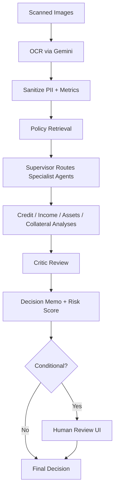

# Durable Gemini Loan Origination

[](https://github.com/samingbar/durable-gemini-loan-origination/actions/workflows/ci.yml)
[](LICENSE)

Temporal-powered mortgage underwriting demo with Gemini for OCR + agentic analysis and a built-in human review UI.

This repository showcases an end-to-end workflow that:
- Ingests scanned loan documents (PNG/JPG)
- Extracts structured mortgage applications with Gemini multimodal OCR
- Runs specialist underwriting analyses (credit, income, assets, collateral)
- Grounds decisions against a policy PDF
- Produces a structured decision memo and risk score
- Gates conditional decisions for human review via a FastAPI UI

> This is a demo system using synthetic data and simplified policy logic. Do not use it for real lending decisions.

## Workflow At A Glance



## Key Capabilities

- OCR-first intake from image bundles in `datasets/images` or uploads from the UI
- PII sanitization before LLM prompts, with bias signal scanning on outputs
- Policy grounding using `resources/underwriting_policies.pdf` and token overlap retrieval
- Supervisor-driven routing that prioritizes missing specialist analyses
- Deterministic fallbacks if LLM JSON is malformed
- Human review gates for conditional decisions, implemented via Temporal signals
- Test coverage for activities, utilities, and workflow signaling

## Quickstart (Local)

### Prerequisites

- Python 3.12+
- `uv` for dependency management
- Temporal CLI (for local dev server)
- A Gemini API key

### Install

```bash
uv sync --dev
```

### Configure Environment

```bash
# Use either GEMINI_API_KEY or GOOGLE_API_KEY
export GEMINI_API_KEY="your_api_key"
# export GOOGLE_API_KEY="your_api_key"
# Optional: override Gemini model (default: gemini-2.5-flash)
export GEMINI_MODEL="gemini-2.5-flash"
# Optional: Temporal server address (default: localhost:7233)
export TEMPORAL_ADDRESS="localhost:7233"
# Optional: task queue (default: mortgage-underwriting)
export MORTGAGE_TASK_QUEUE="mortgage-underwriting"
# Optional: upload directory for the review UI
export UPLOAD_ROOT="datasets/uploads"
```

Notes:
- `src/workflows/mortgage/worker.py` currently connects to `localhost:7233` directly. If you need a remote Temporal server, update that file.
- `demo.py` and `worker.py` load `.env` from the repo root if present.

### Run The Demo

1. Start Temporal dev server:

```bash
temporal server start-dev
```

1. Start the worker (new terminal):

```bash
uv run -m src.workflows.mortgage.worker
```

1. Start the human review UI (new terminal):

```bash
uv run uvicorn src.workflows.mortgage.review_app:app --reload
```

1. Run sample cases (new terminal):

```bash
uv run -m src.workflows.mortgage.demo --image-dir datasets/images
```

1. Open the UI:

```text
http://localhost:8000
```

You can also upload your own case images from the UI. The workflow expects files named like `CASEID_p1.png`, `CASEID_p2.png`, etc. If no case-scoped files exist, the OCR step will use all images in the directory.

## Data Assets

- `resources/underwriting_policies.pdf` is used to ground LLM prompts.
- `resources/mortgage_test_cases.json` contains 3 synthetic cases used in tests.
- `datasets/images` and `datasets/pdfs` hold generated sample inputs.
- `datasets/profiles.json` contains the raw synthetic profile data.

### Regenerating Synthetic Data (Optional)

The dataset generator creates synthetic profiles, PDFs, and OCR-ready images using Gemini.

```bash
uv run -m src.workflows.mortgage.dataset_generator --count 25 --output datasets
```

The generator uses PyMuPDF (`fitz`) for PDF rendering. Install it if you plan to run this step:

```bash
uv add pymupdf
```

## Testing & Quality

```bash
# Run tests with coverage
uv run poe test

# Lint and auto-fix
uv run poe lint

# Format code
uv run poe format
```

## Repository Layout

- `src/workflows/mortgage/mortgage_workflow.py` - Temporal workflow orchestration
- `src/workflows/mortgage/mortgage_activities.py` - OCR, policy retrieval, agent calls
- `src/workflows/mortgage/review_app.py` - FastAPI human review UI
- `src/workflows/mortgage/demo.py` - CLI runner for sample cases
- `src/workflows/mortgage/mortgage_models.py` - Pydantic data models
- `resources/` - policy PDF and test cases
- `datasets/` - synthetic inputs and uploads
- `docs/` - Temporal patterns and testing guidance

## License

MIT License. See `LICENSE`.
